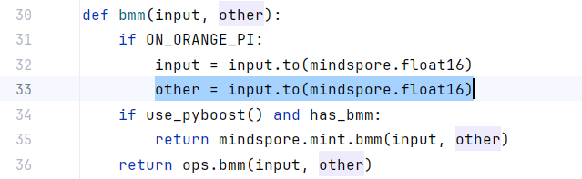
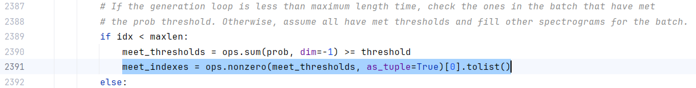
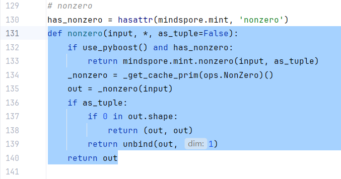
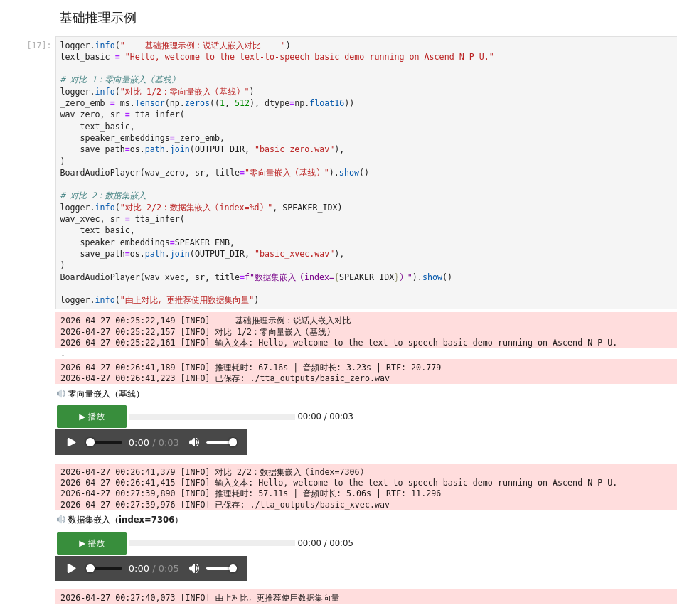
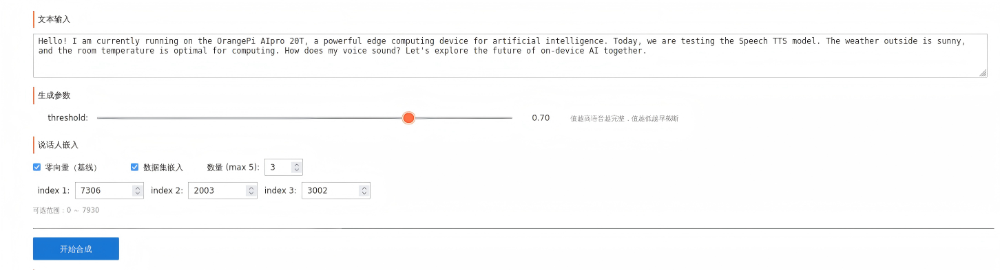
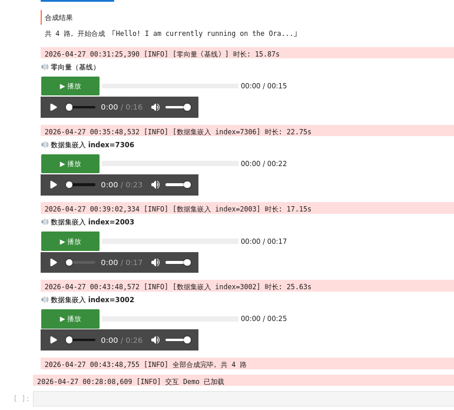

# 文本转语音（Text-to-Audio, TTA）

​	基于 Mindspore NLP 框架，使用 SpeechT5 模型，在香橙派 AIpro 开发板（搭载昇腾 Ascend310B NPU）上实现英文文本的语音合成。支持外部说话人嵌入配置，提供交互式 Demo 演示，可合成自然流畅的英文语音。


## 介绍

​	基于香橙派 AIpro 边缘计算硬件的低功耗、高算力特性，结合 Mindspore NLP 框架的灵活部署能力，实现高质量英文文本转语音合成。该方案采用 SpeechT5 Transformer 编码器-解码器架构与 HiFi-GAN 神经声码器，在昇腾 NPU 上实现实时推理。


## 模型准备（也可直接运行代码在线下载）

**TTS 模型名称：** `microsoft/speecht5_tts`：https://huggingface.co/microsoft/speecht5_tts

**说话人编码器名称：** `microsoft/speecht5_hifigan`：https://huggingface.co/microsoft/speecht5_hifigan

**说话人嵌入数据集：** `Matthijs/cmu-arctic-xvectors`：https://huggingface.co/datasets/Matthijs/cmu-arctic-xvectors


**模型规模**：采用的 SpeechT5 TTS 模型（144.4M 参数）+ HiFi-GAN 声码器（13.92M 参数）+ CMU-Arctic X-Vectors 说话人嵌入数据集（7,931 个 512 维向量），模型权重和数据集总大小约 654MB，参数总量 158.3M，均远低于 4B 参数和 4GB 文件大小的限制要求。


## 环境准备

| 组件       | 版本                                  |
| ---------- | ------------------------------------- |
| 开发板镜像 | Ubuntu                                |
| CANN       | 8.1.RC1                               |
| Mindspore NLP | 0.4.1                                 |
| MindSpore  | 2.6.0                                 |
| Python     | 3.9                                   |
| 开发板型号 | Orange Pi AIpro 20T24G |


## Mindspore NLP 0.4.1 源码适配说明

​	运行本 notebook 文件 前，需手动修改以下 **3 个库文件**（共 4 处）。另外说明对 notebook cell 内 1 处模型配置修改（该部分已在.ipynb中的cell中添加），以适配 OrangePi AIPro 20T (Ascend 310B) 的算子限制。**此部分不可跳过，否则代码执行会遇到报错。** 

---

### 文件 1：`mindnlp/core/ops/blas.py`

**问题**：`ON_ORANGE_PI` 分支将 `other` 错误地赋值为 `input` 转换结果（变量名写错），导致 bmm 两个输入形状相同，触发 `BatchMatMulExt` shape 检查失败。

需修改 `bmm` 函数第 33 行，将：

```python
other = input.to(mindspore.float16)   # 原始错误代码（input 应为 other）
```

替换为：

```python
other = other.to(mindspore.float16)
```

具体代码在如图所示位置：




### 文件 2：`mindnlp/transformers/models/speecht5/modeling_speecht5.py`

**修改 1 — 第 2343 行**

`new_zeros` 在 Mindspore NLP 中只接受单个元组参数，不接受多个位置参数。将：

```python
output_sequence = encoder_last_hidden_state.new_zeros(bsz, 1, model.config.num_mel_bins)
```

替换为：

```python
output_sequence = encoder_last_hidden_state.new_zeros((bsz, 1, model.config.num_mel_bins))
```

具体代码在如图所示位置：


**修改 2 — 第 2391 行**

`ops.nonzero` 不支持以位置参数传入 `as_tuple`，且返回值需要额外处理。将原始调用

```python
meet_indexes = ops.nonzero(meet_thresholds, as_tuple=True)[0].tolist()
```

替换为：

```python
meet_indexes = ops.nonzero(meet_thresholds)[:, 0].tolist()
```

具体代码在如图所示位置：




### 文件 3：`mindnlp/core/ops/array.py`

**问题**：`mindspore.mint.nonzero` 不接受 `as_tuple` 关键字参数，原实现将其直接透传给 mint 导致报错。

将第 131–138 行的 `nonzero` 函数修改为先调用 `mint.nonzero(input)`（不传 as_tuple），再在 Python 层手动处理 `as_tuple` 逻辑：

```python
def nonzero(input, *, as_tuple=False):
    if use_pyboost() and has_nonzero:
        out = mindspore.mint.nonzero(input)
        if as_tuple:
            if 0 in out.shape:
                return (out, out)
            return unbind(out, 1)
        return out
    _nonzero = _get_cache_prim(ops.NonZero)()
    out = _nonzero(input)
    if as_tuple:
        if 0 in out.shape:
            return (out, out)
        return unbind(out, 1)
    return out
```

具体代码在如图所示位置：



### Notebook cell内配置（非库文件）

**模型加载 cell 中**，310B 不支持 BatchNorm1d（`aclnnBatchNormGetWorkspaceSize` 报错），需在 `model.half()` 之后加入：

```python
model.speech_decoder_postnet.postnet = lambda x: x # 此行已在.ipynb文件中的cell添加，此处只作说明，无需额外修改
```

以恒等映射绕过 postnet 的 BatchNorm 层。


## 快速开始

按照**源码适配**部分修正后，顺次执行各个cell代码，在文本输入框中输入需要转换的英文文本即可。


## demo 示例

注：提供的 .ipynb文件直接预览时，可能无法渲染出如下图演示中的按键，需要依次执行各个cell后才能正常显示。

### 1. 基础推理Demo



### 2. 交互



生成结果如图（OrangePi Aipro上播放时需插入圆孔耳机点击绿色按键）：



## 核心特性

### 1. **多说话人支持**

- 集成 7931 个说话人的 x-vector 嵌入
- 附加零向量基线对比
- 可灵活配置说话人索引范围 (0～7930)

### 2. **交互式 Demo**

- 基于 Ipywidgets 的实时合成界面
- 可调节 threshold 参数控制语音完整性
- 同时支持板载 MPI 音频输出和远程浏览器播放

